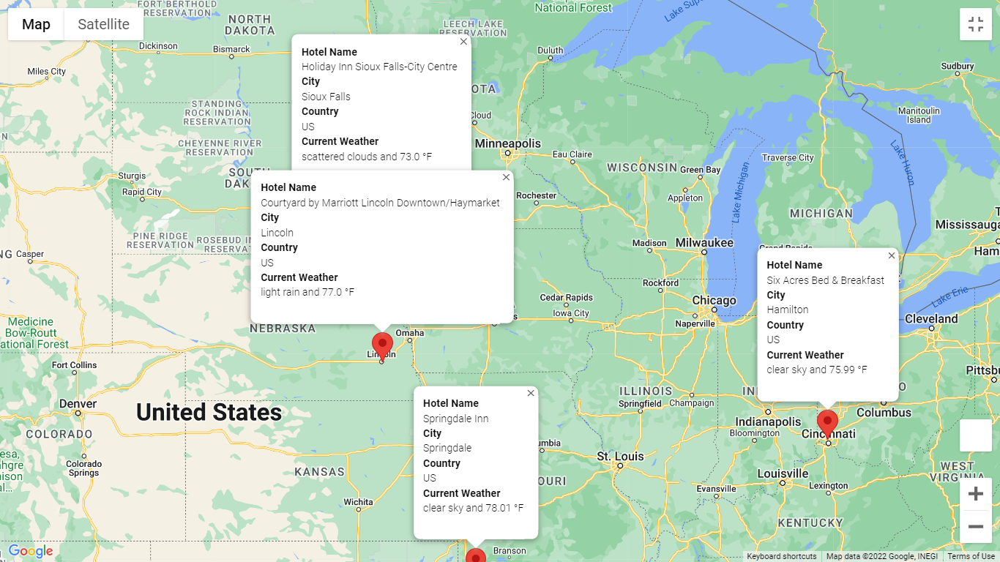
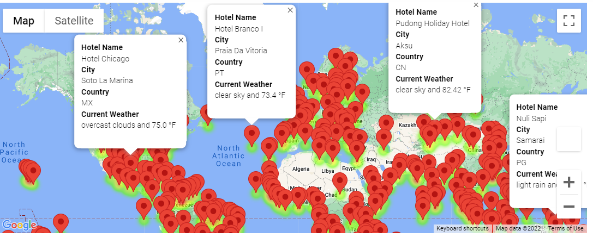

# World_Weather_Analysis
Overview:
 
 In this project, a travel app is developed for the clients with weather preferences and the recommendations of hotels.
 
 

Summary:

In this map, the customers/clients can filter the preferences, this will show them the heatmap that will show the temperatures of the cities.
They can view the map directions between multiple cities with details of the nearest hotels.

A weather description to the pop-up markers will be displayed for customers so that they know what the weather is as they are traveling.

